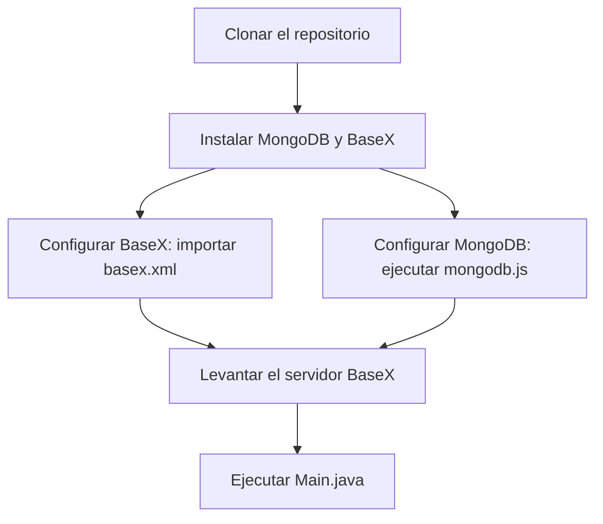

# Tarea 401 - Plataforma de Comercio Electrónico para Videojuegos

## Enunciado de la Entrega

El fichero a entregar será `401.zip` y contendrá los siguientes archivos:

- `mongodb.js`: Archivo con el código necesario para generar la base de datos en MongoDB.
- `basex.xml`: Archivo XML para generar la base de datos en BaseX.
- `src/`: Carpeta con el código fuente de la aplicación en Java.

### Consideraciones Generales

- Se debe implementar un menú claro y conciso para realizar las operaciones requeridas.
- Todos los mensajes mostrados (información, entrada de datos y errores) deben ser comprensibles.
- Se penalizará el uso de Java para obtener resultados si existe una consulta directa en XQuery o MongoDB.
- Cualquier código que:
    - Se detecte como copia.
    - No compile ni ejecute correctamente.

  No será corregido y recibirá una puntuación de 0.

---

## Descripción del Proyecto

El objetivo es desarrollar una plataforma de comercio electrónico para la compra de videojuegos. Los usuarios podrán explorar videojuegos, añadirlos a su carrito, realizar compras y gestionar sus cuentas. La aplicación usará dos bases de datos:

1. **Base de Datos en BaseX**: Contiene datos estáticos de videojuegos.
2. **Base de Datos en MongoDB**: Gestiona información dinámica como usuarios, compras y carritos.

### Estructura de la Base de Datos en MongoDB

Se ha optado por usar tres colecciones separadas para organizar los datos:

- `Usuario`: Almacena la información personal de cada usuario.
- `Carrito`: Contiene la lista de videojuegos que el usuario ha seleccionado para comprar.
- `Compras`: Registra los videojuegos que el usuario ha comprado.

---

## Funcionalidades a Implementar

### Operaciones en BaseX (XML)

1. Modificar el valor de un elemento según un ID.
2. Eliminar un videojuego según su ID.
3. Listar todos los videojuegos ordenados por plataforma y título.
4. Listar videojuegos filtrados por edad mínima recomendada.
5. Mostrar el videojuego más barato por plataforma.
6. Buscar videojuegos por una subcadena en su descripción.
7. Calcular la cantidad total de videojuegos por plataforma y su porcentaje.
8. Calcular el precio total de todos los videojuegos disponibles.

### Operaciones en MongoDB

9. Crear un nuevo usuario (sin emails repetidos).
10. Identificar usuario por email.
11. Borrar un usuario.
12. Modificar la información de un usuario.
13. Añadir videojuegos al carrito.
14. Mostrar el contenido del carrito y su coste total.
15. Comprar el carrito (confirmando la compra y registrándola en `Compras`).
16. Mostrar las compras de un usuario con sus fechas.
17. Calcular el coste total de cada carrito y listar los resultados de mayor a menor.
18. Calcular el total gastado por cada usuario en compras y ordenarlos de menor a mayor.

---

## Estructura del Proyecto

```plaintext
401/
│── src/
│   ├── conexion/  # Clases de conexión a las bases de datos
│   │   ├── ConexionBaseX.java
│   │   ├── ConexionMongo.java
│   ├── modelos/  # Clases de dominio
│   │   ├── Usuario.java
│   │   ├── Videojuego.java
│   ├── utilidades/  # Recursos y configuraciones
│   │   ├── StringResources.java
│   ├── Main.java  # Punto de entrada principal
│── creacion_dbs/  # Scripts de generación de bases de datos
│   ├── mongodb.js
│   ├── basex.xml
│── README.md
```

---

## Pasos para Ejecutar la Aplicación



### 1. Clonar el repositorio
```sh
git clone https://github.com/MateoCarballo/Entregable-AD-4
cd 401
```

### 2. Instalar MongoDB y BaseX
Si no los tienes instalados, descárgalos desde:
- [BaseX](https://basex.org/download/)
- [MongoDB](https://www.mongodb.com/try/download/community)

### 3. Configurar BaseX
- Abrir **BaseX GUI**.
- Seleccionar "Añadir base de datos desde archivo".
- Elegir el archivo `basex.xml` en la carpeta `creacion_dbs/`.

### 4. Configurar MongoDB
- Abrir la terminal y ejecutar:
```sh
mongosh
use comercio
```
- Copiar y pegar el contenido de `mongodb.js` en la terminal y ejecutarlo.

### 5. Levantar el servidor BaseX
- En la terminal, ejecutar:
```sh
basexserver
```

### 6. Ejecutar la aplicación
- Ejecutar `Main.java` en un entorno Java compatible.

---

## Notas Adicionales

- Se recomienda revisar las estructuras de documentos en MongoDB para enlazar correctamente las colecciones.
- El script `mongodb.js` debe contener datos suficientes para que las consultas 17 y 18 funcionen sin ejecutar otras operaciones previas.

<style>
  h1, h2, h3 {
    color: #2c3e50;
  }
  code {
    background-color: #ecf0f1;
    padding: 2px 4px;
    border-radius: 4px;
  }
  pre {
    background: #f4f4f4;
    padding: 10px;
    border-radius: 5px;
  }
  blockquote {
    border-left: 4px solid #3498db;
    padding-left: 10px;
    font-style: italic;
    color: #7f8c8d;
  }
</style>

---
